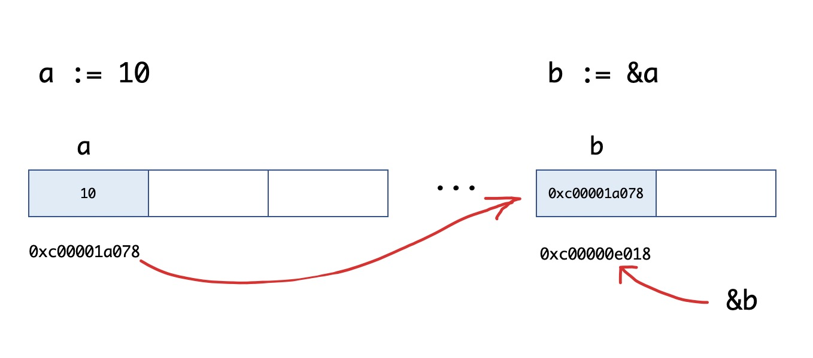

# 函数

```go
// 支持函数，匿名函数和闭包，且函数属于'一等公民'
func 函数名(参数)(返回值){
  函数体
}

// 注意，调用有返回值的函数时，可以不接收其返回值。

// 参数：函数的参数中如果相邻变量的类型相同，则可以省略类型
func intSum(x, y int) int {
	return x + y
}
// 可变参数:指函数的参数数量不固定。可变参数通过在参数名后加...来标识。
func intSum2(x ...int) int {
	fmt.Println(x) //x是一个切片
	sum := 0
	for _, v := range x {
		sum = sum + v
	}
	return sum
}
// 返回值:支持多返回值，函数如果有多个返回值时必须用()将所有返回值包裹起来
// 函数定义时可以给返回值命名，并在函数体中直接使用这些变量，最后通过return关键字返回。
func calc(x, y int) (sum, sub int) {
	sum = x + y
	sub = x - y
	return
}
// 当我们的一个函数返回值类型为slice时，nil可以看做是一个有效的slice，没必要显示返回一个长度为0的切片。
func someFunc(x string) []int {
	return nil // 没必要返回[]int{}
}

// 全局变量:定义在函数外部的变量，它在程序整个运行周期内都有效。 在函数中可以访问到全局变量。
// 局部变量又分为两种： 函数内定义的变量无法在该函数外使用
// 如果局部变量和全局变量重名，优先访问局部变量。
```

```go
// 函数类型与变量
// 凡是满足条件 calculation类型的函数，都是calculation类型。
type calculation func(int, int)int

func add(x ,y int)int  {
	return x+y
}
func sub(x,y int){
  return x-y
}
// add和sub都能赋值给calculation类型的变量。
func main() {
	 var fn calculation
	 fn = add
	 fmt.Println(fn(1,2))
} 

// 函数类型变量
func main() {
	var c calculation               // 声明一个calculation类型的变量c
	c = add                         // 把add赋值给c
	fmt.Printf("type of c:%T\n", c) // type of c:main.calculation
	fmt.Println(c(1, 2))            // 像调用add一样调用c

	f := add                        // 将函数add赋值给变量f1
	fmt.Printf("type of f:%T\n", f) // type of f:func(int, int) int
	fmt.Println(f(10, 20))          // 像调用add一样调用f
}
```

```go
// 高阶函数 (将函数作为参数或者返回值)

// 函数作为参数
func add(x ,y int)int  {
	return x+y
}
func calc(x,y int,op func(int,int)int) int {
	return op(x,y)
}
func main() {
	s:=calc(2,9,add)
	fmt.Println(s)
} 
// 函数作为返回值
func add(x ,y int)int { return x+y }
func sub(x,y int) int { return x-y }
func do(s string) (func(int,int)int,error) {
	switch s {
	case "+":
		return add,nil
	case "-":
		return sub,nil
	default:
		err:=errors.New("无法识别操作符")
		return nil,err
	}
}
func main() {
	fn,err:=do("-")
	if err==nil{
		s:=fn(1,2)
		fmt.Println(s)
	}else{
		fmt.Println(err.Error())
	}
}

// 匿名函数 多用于实现回调函数和闭包。
func (参数)(返回值){
  函数体
}
// 匿名函数因为没有函数名，所以没办法像普通函数那样调用，所以匿名函数需要保存到某个变量或者作为立即执行函数:
func main() {
	// 将匿名函数保存到变量
	add:= func(x,y int) int {
		return x+y
	}
	fmt.Println(add(1,3)) // // 通过变量调用匿名函数
  // 自执行函数:匿名函数定义完加()直接执行
	func(x,y int){
		println(x,y)
	}(10,29)
}

// 闭包
// 闭包指的是一个函数和与其相关的引用环境组合而成的实体。
// 简单来说，闭包=函数+引用环境
func adder() func(int)int  {
	var x int
	return func(y int) int {
		x+=y
		return x
	}
}
func main() {
	f1 := adder()
	fmt.Println(f1(10)) // 10
	fmt.Println(f1(10))	// 20
	fmt.Println(f1(10)) // 30

	f2 := adder()
	fmt.Println(f2(20)) // 20
	fmt.Println(f2(40)) // 60
}
// 变量f是一个函数并且它引用了其外部作用域中的x变量，此时f就是一个闭包。 // 在f的生命周期内，变量x也一直有效
```

```go
// defer 语句
// defer语句会将其后面跟随的语句进行延迟处理
// 先被defer的语句最后被执行，最后被defer的语句，最先被执行。
// 由于defer语句延迟调用的特性，所以defer语句能非常方便的处理资源释放问题。
// 比如：资源清理、文件关闭、解锁及记录时间等。
```

```go
// defer执行时机
// 函数中return语句在底层并不是原子操作,它分为给返回值赋值和RET指令两步。
// 而defer语句执行的时机就在返回值赋值操作后，RET指令执行前。

// 重点提示：defer注册要延迟执行的函数时该函数所有的参数都需要 *确定其值*
```


```go
// 内置函数
close() 			// 主要用来关闭channel
len()   			// 求长度，string，array，slice，map，channel
new() 				// 用来分配内存，主要用来分配值类型，比如int struct。返回的是指针
make()  			// 用来分配内存，主要用来分配引用类型，比如chan，map，slice
append()			// 用来追加元素数组，slice中
panic/recover // 用来做错误处理

// Go语言通过 panic/recover 模式来出来错误。
// panic可以在任何地方引发，但recover只有在defer调用的函数中有效。
func funcA() {
	fmt.Println("func A")
}
func funcB() {
	defer func() {
		err := recover()
		//如果程序出出现了panic错误,可以通过recover恢复过来
		if err != nil {
			fmt.Println("recover in B")
		}
	}()
	panic("panic in B")
}
func funcC() {
	fmt.Println("func C")
}
func main() {
	funcA()
	funcB()
	funcC()
}
// 注意：
// recover()必须搭配defer使用。
// defer一定要在可能引发panic的语句之前定义。
```


# 指针

```go
// 指针需要先知道3个概念：指针地址、指针类型和指针取值。
// 每个变量在运行时都拥有一个地址，这个地址代表变量在内存中的位置
// 而为了保存一个数据在内存中的地址，我们就需要指针变量。
prt := &v // 取变量指针 v:代表取地址，ptr:用于接收地址的变量，ptr的类型就为*T，称做T的指针类型。*代表指针。

func main() {
	a := 10
	b := &a
	fmt.Printf("a:%d ptr:%p\n", a, &a) // a:10 ptr:0xc00001a078
	fmt.Printf("b:%p type:%T\n", b, b) // b:0xc00001a078 type:*int
	fmt.Println(&b)                    // 0xc00000e018
}
```



```go
// 取地址操作符 & 和 取值操作符 * 是一对互补操作符。
// & 取出地址，* 根据地址取出地址指向的值
// * 对变量进行取地址(&)操作，可以获得这个变量的指针变量
// * 指针变量的值就是指针地址
// * 对指针变量进行取值(*)操作,可以获得指针变量指向的原变量的值
```


```go
// 在Go语言中对于引用类型的变量，使用的时候不仅要声明，还要为其分配内存空间
// 值类型的声明不需要分配内存空间，是因为他们在声明的时候已经默认分配好了

func new(Type) *Type
// Type 表示类型，*Type表示类型指针
// new 函数不常用,使用new函数得到的是一个指针类型，并且该指针对应的值为该类型的零值

func make(t Type,size ...IntegerType) Type
// make 也用于分配内存,只用于slice,map,chan的内存创建，且返回的类型就是这三个类型本身，而不是他们的指针类型，


// new和make的区别
// 1，都是用来做内存分配
// 2，make只用来做slice，map，channel的初始化,返回的还是这三个引用类型本身
// 3，new用于类型的内存分配，并且内存对应的值为类型零值，返回的是指向类型的指针
```


# 结构体

**Go语言中使用结构体的内嵌，再配合结构实现比面向对象更高拓展性，灵活性的 "类"**

```go
// 类型别名和自定义类型
// type 关键字来自定义类型
type MyInt int // 将MyInt定义为int类型 MyInt就是一种新的类型，它具有int的特性
// 类型别名
type TypeAlias = Type // TypeAlias 只是Type的别名，本质上TypeAlias与Type是同一个类型
// rune和byte就是类型别名
type byte = uint8
type rune = int32

// NewInt 的类型是 main.NewInt，表示main包下定义的NewInt类型。
// MyInt  的类型是int。MyInt类型只会在代码中存在，编译完成时并不会有MyInt类型。
//类型定义
type NewInt int
//类型别名
type MyInt = int
```

```go
// struct 结构体：一种自定义数据类型，可以封装多个基本数据类型
// 通过 struct 来定义自己的类型
type 类型名 struct{
  字段名 字段类型
  字段名 字段类型
  ...
}
// 类型名：表示自定义结构体的名称，在同一个包内不能重复
// 字段名：表示结构体字段名，结构体中的字段名必须唯一
// 字段类型：表示结构体字段的具体类型

// 结构体实例化
// 只有结构体实例化，才会真正的分配内存，也就是必须实例化后才能使用结构体字段
// 结构体也是一种类型，我们可以像声明内置类型一样使用var 关键值来声明结构体类型
var 结构体实例 结构体类型

type Person struct {
	name string
	age int
	city string
}
func main() {
	 var p Person
   // 通过.来访问结构体的字段（
  ）
	 p.age = 19
	 p.name = "张三"
	 p.city = "成都" 
}

// 匿名结构体
// 定义一些临时数据机构等场景下使用
func main() {
	var user struct{Name string;Age int}
	user.Name = "王麻子"
	user.Age = 19
}

// 创建指针类型结构体
// 通过new关键值对结构体进行实例化，得到结构体指针
p1 := new(Person)
// 支持对结构体指针直接使用.来访问结构体的成员

// 取结构体的地址实例化
// 使用&对结构体进行取地址操作相当于对该结构体类型进行了一次new实例化操作。
p2 := &Person{}

// 结构体初始化
// 没有初始化的结构体，其成员变量对应起类型的零值
// 使用键值对初始化 (如果没有初始值可以不填，为默认零值)
p5:=Person{name:"张三",age:19,city:"成都"}
// 也可以对结构体指针进行键值对初始化
p5:=&Person{name:"张三",age:19,city:"成都"}

// 使用值的列表初始化
// 初始化结构体的时候可以简写，也就是初始化的时候不写键，直接写值
p5:=Person{"张三",10,"成都"}
// * 必须初始化结构体的所有字段。
// * 初始值的填充顺序必须与字段在结构体中的声明顺序一致。
// * 该方式不能和键值初始化方式混用。


// 结构体占用一块连续内存

// 空结构体 空结构体不占用空间的
```

```go
// 构造函数
// 自己实现构造函数
func NewPerson(name ,city string,age int) *Person {
	return &Person{
		name:name,
		city:city,
		age:age,
	}
}

// 方法和接收者
// Go语言的方法(Methdo) 是一种作用于特定类型变量的函数，这种特定类型变量叫做接收者，
func (接收者变量 接收者类型) 方法名(参数列表)(返回参数){
  	函数体
}
// 接收者变量：接收者中的参数变量在命名时，官方建议使用接收者类型名称首字母的小写，而不是self,this之类的命名
// 接收者类型：接收者类型和参数变量类似，可以是指针类型和非指针类型
// 方法名，参数列表，返回参数：具体格式于函数定义相同
// 例:
type Person struct {
	name string
	age int
	city string
}
func NewPerson(name ,city string,age int) *Person {
	return &Person{
		name:name,
		city:city,
		age:age,
	}
}
func (p Person) Dream()  {
	fmt.Println("人都有梦想~~~~~")
}
func main() {
	p1:= NewPerson("张三","成都",12)
	p1.Dream()
}
// 方法与函数的区别是，函数不属于任何类型，方法属于特定的类型

// 指针类型接收者：由一个结构体的指针组成，由于指针的特性，调用方法来修改接收者指针的任意成员变量，在方法结束后，修改都是有效的

// 值类型接收者：当方法作用于值类型接收者时，代码运行时将接收者的值复制一份，所以只能获取接收者的成员变量值，修改只能对副本进行操作，无法修改接收者变量本身

// 什么时候使用指针类型接收者
// * 需要修改接收者中的值
// * 接收者是拷贝代价比较大的对象
// * 保证一致性，如果有某个方法使用了指针接收者,那么其他的方法也应该使用指针指针接收者


// 任意类型添加方法
// 接收者类型可以是任意类型，不仅仅是结构体
// 非本地类型不能定义方法,也就是不能给别的包的类型定义方法。
type MyInt int
func (m MyInt)SayHello () {
	fmt.Println("int say hello ~~~")
}
func main() {
	var m MyInt
	m.SayHello()
}
```

```go
// 结构体的匿名字段:结构体允许成员变量在声明时么有字段名，只有类型，
// 结构体匿名字段会默认采用类型名作为字段名，因此结构体要求字段类型必须唯一
type Person1 struct {
	string
	int
}
var p2 = Person1{"张三",12}

// 嵌套结构体
// 一个结构体可以嵌套另一个结构体或结构体指针
type Address struct {
	Province string
	City string
}
type User struct {
	Name string
	Age int8
	Address Address
}
func main() {
	var u = User{
		Name:    "张山",
		Age:     21,
		Address: Address{
			Province:"四川",
			City:"成都",
		},
	}
}
// 结构体嵌套匿名字段:当访问结构体成员时会先在结构体中查找该字段，找不到再去嵌套的匿名字段中查找
type Address struct {
	Province string
	City string
}
type User struct {
	Name string
	Age int8
	Address
}
func main() {
	var u User
	u.Name = "张"
	u.Age = 12
	u.Address.Province = "四川"
	u.City = "成都"  
}
// 嵌套结构体字段名冲突
// 嵌套结构体内部可能存在相同的字段名
type Address struct {
	Province string
	City string
	CreateTime string
}
type Email struct {
	CreateTime string
}
type User struct {
	Name string
	Age int8
	Address
	Email
}
func main() {
	var u User
	u.Name = "张"
	u.Age = 12
	u.Address.Province = "四川"
	u.City = "成都"
	// u.CreateTime = "2020-10-10" // Ambiguous reference 'CreateTime' 
	u.Address.CreateTime = "2020-10-10"
	u.Email.CreateTime =  "2020-10-10" 
	fmt.Printf("%#v \n",u)
}

// 结构体的“继承”
type Animal struct {
	name string
}
type Dog struct {
	Feet int8
	Animal
}
func (a Animal) move() {
	fmt.Printf("%s 会动～～～\n",a.name)
}
func (d Dog)wang(){
	fmt.Printf("%s 汪汪汪~~ \n",d.name)
}
func main() {
	 var d = Dog{
		 Feet:   12,
		 Animal: Animal{
		 	name:"五一",
		 },
	 }
	 d.move()
	 d.wang()
}

// 结构体字段可见性：结构体中字段大写开头表示可以公开访问，小写表示私有(仅在定义当前结构体的包中访问)
```

```go
// 结构体与json序列化
// JSON 是一种轻量级的数据交换格式。易于人的阅读和编写，也易于机器解析和生成
//Student 学生
type Student struct {
	ID     int
	Gender string
	Name   string
}

//Class 班级
type Class struct {
	Title    string
	Students []*Student
}

func main() {
	c := &Class{
		Title:    "101",
		Students: make([]*Student, 0, 200),
	}
	for i := 0; i < 10; i++ {
		stu := &Student{
			Name:   fmt.Sprintf("stu%02d", i),
			Gender: "男",
			ID:     i,
		}
		c.Students = append(c.Students, stu)
	}
	//JSON序列化：结构体-->JSON格式的字符串
	data, err := json.Marshal(c)
	if err != nil {
		fmt.Println("json marshal failed")
		return
	}
	fmt.Printf("json:%s\n", data)
	//JSON反序列化：JSON格式的字符串-->结构体
	str := `{"Title":"101","Students":[{"ID":0,"Gender":"男","Name":"stu00"},{"ID":1,"Gender":"男","Name":"stu01"},{"ID":2,"Gender":"男","Name":"stu02"},{"ID":3,"Gender":"男","Name":"stu03"},{"ID":4,"Gender":"男","Name":"stu04"},{"ID":5,"Gender":"男","Name":"stu05"},{"ID":6,"Gender":"男","Name":"stu06"},{"ID":7,"Gender":"男","Name":"stu07"},{"ID":8,"Gender":"男","Name":"stu08"},{"ID":9,"Gender":"男","Name":"stu09"}]}`
	c1 := &Class{}
	err = json.Unmarshal([]byte(str), c1)
	if err != nil {
		fmt.Println("json unmarshal failed!")
		return
	}
	fmt.Printf("%#v\n", c1)
}

// 结构体标签（Tag）
// Tag是结构体的元信息，可以在运行的时候通过反射的机制读取出来
`key1:"value1" key2:"value2"`
// 结构体tag由一个或多个键值对组成。键与值使用冒号分隔，值用双引号括起来。同一个结构体字段可以设置多个键值对tag，不同的键值对之间使用空格分隔。
//  为结构体编写Tag时，必须严格遵守键值对的规则。
// 结构体标签的解析代码的容错能力很差，一旦格式写错，编译和运行时都不会提示任何错误，通过反射也无法正确取值。
// 例如不要在key和value之间添加空格。

//Student 学生
type Student struct {
	ID     int    `json:"id"` //通过指定tag实现json序列化该字段时的key
	Gender string //json序列化是默认使用字段名作为key
	name   string //私有不能被json包访问
}
func main() {
	s1 := Student{
		ID:     1,
		Gender: "男",
		name:   "沙河娜扎",
	}
	data, err := json.Marshal(s1)
	if err != nil {
		fmt.Println("json marshal failed!")
		return
	}
	fmt.Printf("json str:%s\n", data) //json str:{"id":1,"Gender":"男"}
}
```

```go
// 因为slice和map这两种数据类型都包含了指向底层数据的指针，因此我们在需要复制它们时要特别注意。 
type Person struct {
	name   string
	age    int8
	dreams []string
}
func (p *Person) SetDreams(dreams []string) {
	p.dreams = dreams
}
func main() {
	p1 := Person{name: "小王子", age: 18}
	data := []string{"吃饭", "睡觉", "打豆豆"}
	p1.SetDreams(data)
	// 你真的想要修改 p1.dreams 吗？
	data[1] = "不睡觉"
	fmt.Println(p1.dreams)  // ?
}
// 正确的做法是在方法中使用传入的slice的拷贝进行结构体赋值。
func (p *Person) SetDreams(dreams []string) {
	p.dreams = make([]string, len(dreams))
	copy(p.dreams, dreams)
}
// 同样的问题也存在于返回值slice和map的情况，在实际编码过程中一定要注意这个问题。
```

