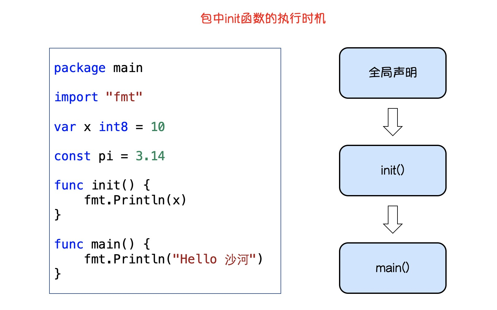
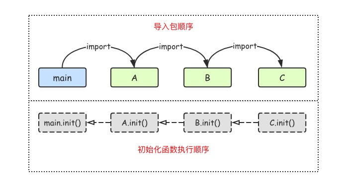
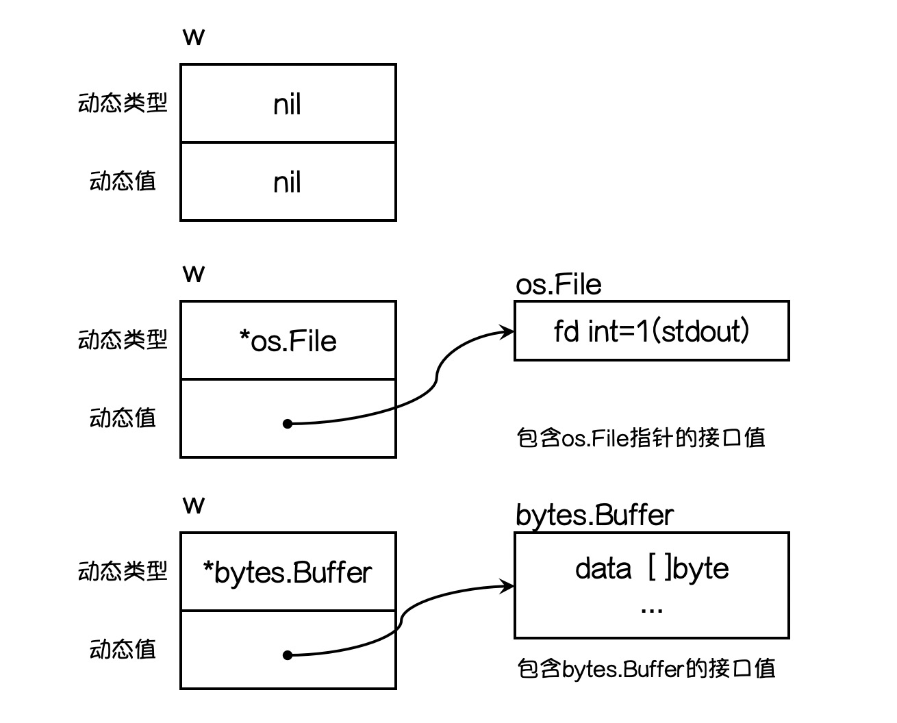

# 包

```go
// 包: (package)是多个Go源码的集合，是一种高级的代码复用方案
// 定义：
// 1，可以根据自己的需要创建自己的包。
// 2，一个包可以简单理解为一个存放.go文件的文件夹
// 3，该文件夹下面的所有go文件在代码的第一行添加代码，声明该文件归属的包
package 包名
// 注意事项
// * 一个文件夹下面直接包含的文件只能归属一个package，同样一个package的文件不能在多个文件夹下
// * 包名可以不和文件夹的名字一样，包名不能包含 - 符号
// * 包名为main的包为应用程序的入口包，这种包编译后得到一个可执行文件，而编译不包含main包的源码则不会得到可执行文件
```

```go
// 可见性
// 如果要在其他包引用当前包里的标识符(变量,常量,类型,函数)时，该标识符必须时对外可见的(public)
// 只需要将标识符的首字母大写就可以让标识符对外可见
// 结构体中的字段名和接口中的方法,需要首字母大写才可以在外部包访问
```

```go
// 包的导入
import "包的路径"
// 注意:
// * import 导入语句通常放在文件开头包声明语句的下面
// * 导入的包名需要使用双引号包裹起来
// * 包名时充 $GOPATH/src/后面开始计算的,使用/进行路径分隔
// * Go语言禁止循环导入包
import "包1"
import "包2"
import (
	"包1"
  "包2"
)
// 自定义包名
import 别名 "包的路径"
// 例：
import "fmt"
import m "github.com/Q1mi/studygo/pkg_test"
func main() {
	fmt.Println(m.Add(100, 200))
	fmt.Println(m.Mode)
}

// 匿名导入包
// 只导入，而不使用包内部的数据时，可以使用匿名导入包
// 匿名导入的包与其他方式导入的包一样会被编译到可执行文件中
import _ "包的路径"
```

```go
// init() 初始化函数
// 程序执行导入包语句会触发内部init()函数的调用，
// init() 函数没有参数，没有返回值
// init() 函数在程序运行时自动被调用执行,不能在代码中主动调用它

// init() 函数的执行顺序
// * 从main包开始检查其导入的所有包,每个包又可能导入其他的包
// * 编译器由此构建出一个树状的包引用关系，再根据引用顺序决定编译顺序，依次编译这些包的代码
// 总结：在运行时，最后被导入的包会先初始化并调用其init()函数
```






# 接口

```go
// 接口(interface) 定义了一个对象的行为规范，只定义规范步实现，由具体的对象来实现规范的细节
// 接口是一种类型，是一种抽象类型。

// 接口的定义:
type 接口类型名 interface{
  方法1( 参数列表1 ) 返回值列表1
  方法2( 参数类别2 ) 返回值列表2
}
// 其中：
// * 接口名: 
// 				一样type配将接口定义为自定义的类型名。
// 				Go语言的接口在命名时，一般会在单词后加er
//				接口名最好能突出该接口的类型含义
// * 方法名:当方法名首字母是大写的且这个接口类型名首字母也是大写，这个方法可以被接口所在的包(package)之外的代码访问
// * 参数列表和返回值列表的变量名可以省略
type writer interface{
  Write([]byte) error
}

// 接口的实现
// 一个对象只要全部实现了接口中的方法，那么就实现了这个接口
type Sayer interface{
	say()
}
type dog struct {}
type cat struct {}
func (d dog)say(){
	fmt.Println("汪汪汪")
}
func (c cat)say()  {
	fmt.Println("喵喵喵")
}

var _ Sayer = &cat{}
var _ Sayer = &dog{}

// 接口类型变量能存储所有实现了该接口的实例
func main() {
	 var x Sayer
	 x = dog{}
	 x.say()
	 x = cat{}
	 x.say()
}
// 确保对象是否实现了接口
var _ Sayer = &cat{}
var _ Sayer = &dog{} 用于验证 对象是否实现了接口
```

```go
// 值接收者 和 指针接收者 实现接口的区别
type Mover interface{
	move()
}
type dog struct {}
// 值接收者实现接口
func (d dog)move()  {
	fmt.Println("狗会动")
}
func main() {
	var x Mover
	x = dog{}
	x = &dog{}
}
// 指针接收者实现接口
func (d *dog)move()  {
	fmt.Println("狗会动")
}
func main() {
	var x Mover
	//x = dog{} // x 不可接收 dog{} // x 只能存储 *dog类型的值
	x = &dog{} 
}
```

```go
// 类型与接口的关系
// 一个类型实现多个接口
// 一个类型可以实现多个接口，而接口间彼此独立，不知道对方的实现
type Sayer interface {
	say()
}
type Mover interface {
	move()
}
type dog struct {
	name string
}
func (d dog)say() {
	fmt.Printf("%v汪汪汪 \n",d.name)
}
func (d dog)move() {
	fmt.Printf("%v会动 \n",d.name)
}
func main() {
	var s Sayer
	var m Mover
	d:=dog{name:"五一"}
	s=d
	m=d
	s.say()
	m.move()
}
// 多个类型实现同一个接口
type Mover interface {
	move()
}
type dog struct {
	name string
}
type car struct {
	brand string
}
func (c car)move()  {
	fmt.Printf("%v速度70迈/h",c.brand)
}
func (d dog)move() {
	fmt.Printf("%v会动 \n",d.name)
}
func main() {
	var m Mover
	m=dog{name:"五一"}
	m.move()
	m=car{brand:"奔驰"}
	m.move()
}
// 一个接口的方法，不一定需要由一个类型完全实现，接口的方法可以通过在类型中嵌套其他类型或结构体来实现
// 结构体嵌套，也继承了嵌套结构体的接口


// 接口嵌套
// 接口与接口间可以通过嵌套创造出新的接口
type Mover interface {
	move()
}
type Sayer interface {
	say()
}
type Animal interface {
	Sayer
	Mover
}
type cat struct {}
func (c cat)say() {
	fmt.Println("喵喵喵")
}
func (c cat)move() {
	fmt.Println("会动")
}
func main() {
	var a Animal
	a = cat{}
	a.say()
	a.move()
}
```

```go
// 空接口
// 指没有定义任何方法的接口。因此任何类型都实现了空接口
// 空接口类型的变量可以存储任意类型的变量
func main() {
	 var a interface{}
	 a = "123123" 
	 a = false 
	 a = 123 
}
// 空接口实现可以接收任意类型的函数参数
// 空接口可以实现保存任意类型值的字典
func show(a interface{})  {
	fmt.Printf("Type:%T value:%v \n",a,a)
}
func main() {
	a:= make(map[string]interface{})
	a["hh"]=123
	a["bb"]=false
	a["cc"]="123123"
	show(a)
}
```

```go
// 类型断言
// 接口值
// 一个接口的值(简称接口值)是由 一个具体类型 和 具体类型的值 两部组成
// 这两部分分别称为接口的 动态类型 和 动态值
var  w  io.Writer
w = os.Stdout
w = new(bytes.Buffer)
w = nil
```




```go
// 类型断言
x.(T) // x:类型为interface{}的变量 T:断言x可能的类型
// 返回两个参数 第一个参数是x转化为T类型后的变量，第二个参数是一个布尔值,表示断言是否成功
var x interface{}
x="string"
v,ok := x.(string)
if ok {
  fmt.Println(v)
}else{
  fmt.Println(ok)
}
// 多次断言
func justifyType(x interface{})  {
	switch v:=x.(type) {
	case string:
		fmt.Printf("string %v \n",v)
	case int:
		fmt.Printf("int %v \n",v)
	case bool:
		fmt.Printf("bool %v \n",v)
	default:
		fmt.Printf("error")
	}
}
// 因为空接口可以存储任意类型值的特点，所以空接口在Go语言中的使用十分广泛。
// 关于接口需要注意的是：
// * 只有当有两个或两个以上的具体类型必须以相同的方式进行处理时才需要定义接口。
// * 不要为了接口而写接口，那样只会增加不必要的抽象，导致不必要的运行时损耗。

```


