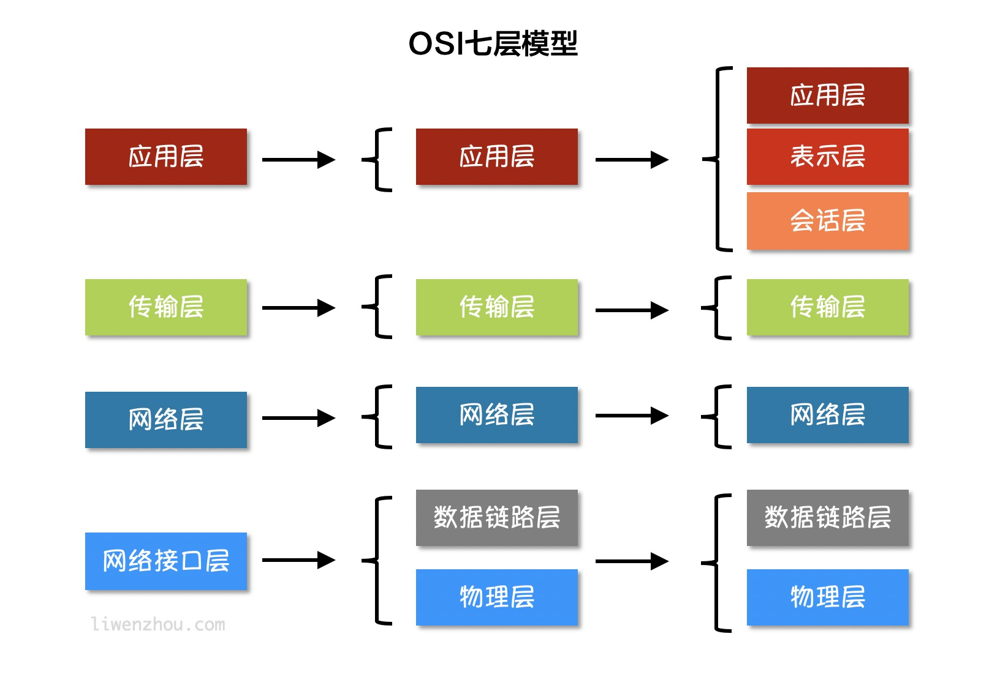
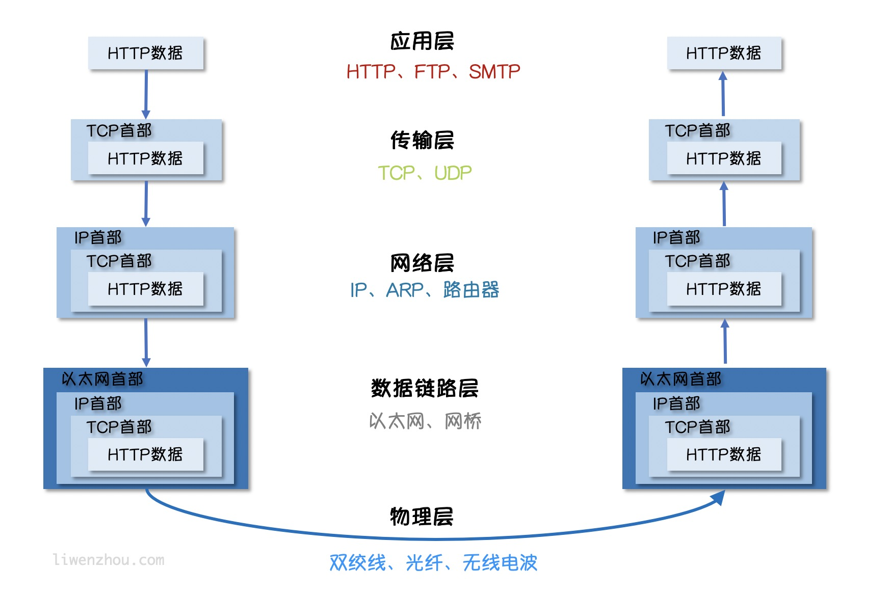
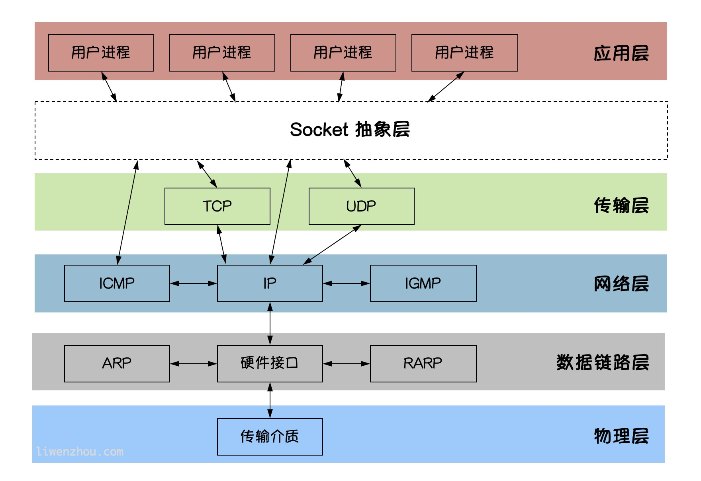

# 网络编程

###  互联网分层模型



```go
// 互联网按照不同的模型划分会有不同分层,上面靠近用户，下面靠近硬件

// 物理层: 电脑链接网络的物理手段，使用双绞线，光纤，无线电等方式。 作用是负责传送0和1的电信号

// 数据链路层: 确定了物理层传输的0和1的分组方式及代表意义,《以太网协议》广播的方式发送数据包，网卡:MAC地址

// 网络层：IP协议规定网络地址，必须先处理网络地址，再处理MAC地址

// 传输层：通过MAC地址和IP地址，建立通信后，在数据包中加入端口信息 UDP协议:简单，易实现，可靠性差，TCP协议：过程复杂，实现困难，消耗资源较多

// 应用层：接收到传输层的数据，对数据进行解包，Email，HTTP,FTP等协议，这些协议组成网络协议等应用层
```




```go
// socket 编程
// Socket是 BSD UNIX 的进程通信机制，通常也称作“套接字”，用于描述ip地址和端口，是通信链等句柄，
// Socket可以理解为TCP/IP网络等API,它定义了许多函数或例程，用来开发TCP/IP网络上的应用程序。
// 应用程序通常通过“套接字”向网络发出请求或者答应网络请求

// socket 图解
// Socket 是应用层与TCP/IP协议族通信的中间软件抽象层。
// 在设计模式中，Socket其实就是一门面模式，它把复杂的TCP/IP协议族隐藏在socket后面，对于用户来说只需要调用socket规定的相关函数，让socket去组织符合规定的协议数据然后进行通信
```



### GO语言实现TCP通信

```go
// TCP/IP (Transmission Control Protocol/Internet Protocol) 即传输控制协议/网间协议
// 是一种面向连接(连接导向)的，可靠的，基于字节流的传输层（Trannsport layer）通信协议，
// 因为是面向连接的协议，数据像流水一样传输，会存在黏包问题。


// TCP 服务端
// 1，监听接口
// 2，接收客户端数据
// 3，创建goroutine 处理链接
func main() {
	listen,err := net.Listen("tcp","127.0.0.1:20000") // 监听端口
	if err!=nil {
		fmt.Println("listen failed err",err)
		return
	}
	for {
		conn,err := listen.Accept() // 建立链接
		if err!=nil {
			fmt.Println("accept failed err",err)
			continue
		}
		go process(conn) // 启动一个goroutine处理链接
	}
}
func process(conn net.Conn)  {
	defer conn.Close() 	//deffer 关闭链接
	for {
		reader:= bufio.NewReader(conn)
		var buf [128]byte
		n,err:=reader.Read(buf[:])
		if err != nil {
			fmt.Println("read from client failed err",err)

			break
		}
		recvSter := string(buf[:n])
		fmt.Println("收到 client 端发来数据：",recvSter)
		conn.Write([]byte(recvSter)) // 发送数据

	}
}


// TCP 客户端
// 1，建立与服务端的链接
// 2，进行数据接收
// 3，关闭链接
func main() {
	conn,err:=net.Dial("tcp","127.0.0.1:20000") //
	if err!=nil {
		fmt.Println("dial err",err)
	}
	defer conn.Close() // 关闭链接
	inputReader := bufio.NewReader(os.Stdin)
	for {
		input ,_ := inputReader.ReadString('\n') // 读取用户输入
		inputInfo := strings.Trim(input,"\r\n")
		if strings.ToUpper(inputInfo) == "Q" { // 用户输入Q就退出
			return
		}
		_,err = conn.Write([]byte(inputInfo)) // 发送数据
		if err != nil {
			return
		}
		buf:=[512]byte{}
		n,err:=conn.Read(buf[:])
		if err!=nil {
			fmt.Println("recv failed,err",err)
			return
		}
		fmt.Println(string(buf[:n]))
	}
}
```


```go
// TCP 黏包


// 多条数据“粘”到了一起
// TCP 服务端
func main() {
	listen,err := net.Listen("tcp","127.0.0.1:20000") // 监听端口
	if err!=nil {
		fmt.Println("listen failed err",err)
		return
	}

	for {
		conn,err := listen.Accept() // 建立链接
		if err!=nil {
			fmt.Println("accept failed err",err)
			continue
		}
		go process(conn) // 启动一个goroutine处理链接
	}

}

func process(conn net.Conn)  {
	defer conn.Close() 	//deffer 关闭链接
	reader:= bufio.NewReader(conn)
	var buf [1024]byte
	for {
		n,err:=reader.Read(buf[:])
		if err != nil {
			fmt.Println("read from client failed err",err)

			break
		}
		recvStr := string(buf[:n])
		fmt.Println("收到 client 端发来数据：",recvStr)
	}

}


// TCP 客户端
func main() {
	conn,err:=net.Dial("tcp","127.0.0.1:20000") //
	if err!=nil {
		fmt.Println("dial err",err)
	}
	defer conn.Close() // 关闭链接
	for i:=0;i<20 ;i++  {
		str := "hello, How are you?"

		_,err = conn.Write([]byte(str))
	}

}


// 为什么出现黏包
// 主要是tcp数据传输是流模式，在保持长连接的时候可以进行多次的收和发送
// “粘包”可发生在发送端也可发生在接收端：
// 由Nagle算法造成的发送端的粘包：Nagle算法是一种改善网络传输效率的算法。简单来说就是当我们提交一段数据给TCP发送时，TCP并不立刻发送此段数据，而是等待一小段时间看看在等待期间是否还有要发送的数据，若有则会一次把这两段数据发送出去。
// 接收端接收不及时造成的接收端粘包：TCP会把接收到的数据存在自己的缓冲区中，然后通知应用层取数据。当应用层由于某些原因不能及时的把TCP的数据取出来，就会造成TCP缓冲区中存放了几段数据。


// 解决方法
// 出现”粘包”的关键在于接收方不确定将要传输的数据包的大小，因此我们可以对数据包进行封包和拆包的操作。
// 封包：封包就是给一段数据加上包头，这样一来数据包就分为包头和包体两部分内容了(过滤非法包时封包会加入”包尾”内容)。包头部分的长度是固定的，并且它存储了包体的长度，根据包头长度固定以及包头中含有包体长度的变量就能正确的拆分出一个完整的数据包。

// proto包
package proto 
// Encode 将消息编码
func Encode(message string)([]byte ,error)  {
	// 获取消息的长度转换为 int32类型 (占4个字节)
	length := int32(len(message))
	pkg := new(bytes.Buffer)
	// 写入消息头
	err:= binary.Write(pkg,binary.LittleEndian,length)
	if err!=nil {
		return nil,err
	}
	// 写入实体消息
	err = binary.Write(pkg,binary.LittleEndian,[]byte(message))
	if err!=nil {
		return nil,err
	}
	return pkg.Bytes(),nil
}


// Decode 将消息解码
func Decode(reader *bufio.Reader) (string,error) {
	// 读取消息的长度
	lengthByte,_ :=reader.Peek(4) //读取前4个字节
	lengthBuff := bytes.NewBuffer(lengthByte)
	var length int32
	err := binary.Read(lengthBuff,binary.LittleEndian,&length)
	if err!=nil {
		return "", err
	}
	// Buffered 返回缓冲中现有的可读取的字节
	if int32(reader.Buffered()) < length+4 {
		return "",err
	}
	// 读取真正的消息
	pack:= make([]byte,int(4+length))
	_,err = reader.Read(pack)
	if err != nil {
		return "", err
	}
	return string(pack[4:]), nil
}


// 服务端
func main() {
	listen,err := net.Listen("tcp","127.0.0.1:20000") // 监听端口
	if err!=nil {
		fmt.Println("listen failed err",err)
		return
	} 
	for {
		conn,err := listen.Accept() // 建立链接
		if err!=nil {
			fmt.Println("accept failed err",err)
			continue
		}
		go process(conn) // 启动一个goroutine处理链接
	}
}
func process(conn net.Conn)  {
	defer conn.Close() 	//deffer 关闭链接
	reader:= bufio.NewReader(conn)
	for {
		msg,err :=proto.Decode(reader)
		if err == io.EOF {
			fmt.Println("EOF",err)
			return
		}
		if err !=nil {
			fmt.Println("read from client failed err",err)

			break
		}
		fmt.Println("收到 client 端发来数据：",msg)
	} 
}

// 客户端
func main() {
	conn,err:=net.Dial("tcp","127.0.0.1:20000") //
	if err!=nil {
		fmt.Println("dial err",err)
	}
	defer conn.Close() // 关闭链接
	for i:=0;i<20 ;i++  {
		str := "hello, How are you?"
		data,err := proto.Encode(str)
		if err!=nil{
			fmt.Println("encode msg failed,err",err)
			return
		} 
		conn.Write(data)
	}
}
```

```go
// Go语言实现UDP通信

// UDP协议(User Datagram Protocol) 又称为 用户数据报协议
// 是SOI(Open System Interconnection 开放式系统互联)参考模型中的一张无连接的传输协议。不需要建立连接就能直接进行数据发送和接收，属于不可靠，没有时序的通信
// UDP协议的实时性比较好,通常用于视频直播相关领域


// UDP 服务端
func main() {
	listen ,err:=net.ListenUDP("udp",&net.UDPAddr{
		IP:   net.IPv4(0,0,0,0),
		Port: 30000,
	})
	if err != nil {
		fmt.Println("listen failed.err",err)
		return
	}
	defer listen.Close()

	for {
		var data [1024]byte
		n,addr,err := listen.ReadFromUDP(data[:])
		if err != nil {
			fmt.Println("read udp failed,err",err)
			continue
		}
		_,err = listen.WriteToUDP(data[:n],addr)
		if err!=nil {
			fmt.Println("write to udp failed,err:",err)
			continue
		}
	}
}
// UDP 客户端
func main() {
	 socket,err := net.DialUDP("udp",nil,&net.UDPAddr{
		 IP:   net.IPv4(0,0,0,0),
		 Port: 30000,
	 })

	if err != nil {
		fmt.Println("链接服务器失败，err:",err)
		return
	}
	defer socket.Close()
	 sendData := []byte("你好啊，服务器")
	 _,err = socket.Write(sendData)
	if err!=nil {
		fmt.Println("发送数据失败",err)
		return
	}
	data := make([]byte,4096)
	n,remoteAddr,err := socket.ReadFromUDP(data)
	if err!=nil {
		fmt.Println("数据接收失败",err)
		return
	}
	fmt.Printf("revb:%v addr:%v counnt:%v \n",string(data[:n]),remoteAddr,n)

}
```

